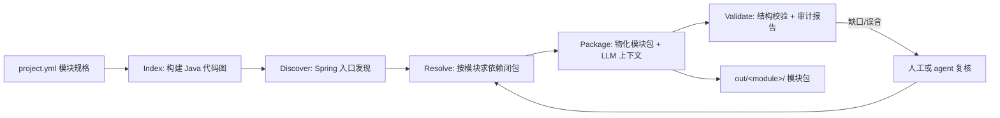

# ReportSpliter 架构设计 v2

> 状态：v1 已冻结。本文是实现的唯一依据；改动需走评审。
> 冻结依据：用户确认的四个决策（见 §0）。
> v1.1 变更：纳入"业务代码 ↔ 算法设计对齐"与"报表血缘"两个业务目标（见 §0.1）。
> v2 冻结：报表产物形态 = Hive 表 + CSV（Excel 暂不处理）；设计侧文档形态 =
> Word(.docx) / Excel(.xlsx) / Markdown（见 §0.2）。

## 0.2 v2 冻结决策（用户确认）

1. **设计侧算法形态**：Word / Excel 文档为主，已部分转为 Markdown。
   实现：`rs design-import` 把三种格式导入为统一步骤规格 `algorithms/<module>.yaml`，
   供 `rs align` 使用；散文/非结构化文本的语义归一化（LLM）为后续增强。
2. **报告产物形态**：主要是 **Hive 表**与 **CSV 文件**，极少量 Excel（暂不处理）。
   实现：Hive 表走 SQL 列级血缘（SQLGlot，覆盖独立 .sql 与宿主代码内嵌 SQL）；
   CSV 走宿主代码写点锚定 + 文件级上游近似；变更追溯 = 报告生产文件 × git 历史。

## 0.1 实际业务目标（v1.1 新增）

用户要解决的真实生产问题：**业务代码与算法设计脱节**——两方由不同体系/人员维护，长时间产生
未跟踪变动，阻碍算法与业务演进。因此工具的核心价值是：

1. **代码 → 算法重建**：从当前业务代码还原出可读、可比的算法（每个步骤带完整代码锚点），
   建立"代码到算法"的完整映射。
2. **算法对齐**：把重建算法与"当前算法（设计侧）"对比，快速产出差异清单
   （设计有/代码无、代码有/设计无、步骤变化、低置信度匹配），差异交人工审核讨论。
3. **报表血缘**：建立服务报告的血缘关系，能追踪单个报告的产生链路与变更，
   支撑统一管理、变更追溯、架构优化。

由此，模块划分（v1）只是第一步：模块闭包是"算法重建"的输入；算法重建是对齐的输入；
对齐报告与审核队列是最终交付物。报表血缘为 v2 主线（需确认报表产物形态，见 §6）。

---

## 0. 已冻结的决策（用户确认）

1. **能力缺口**：现有工具无法正常运行，无法对代码仓库做模块级划分。
2. **目标语言**：Java / Spring（第一优先）；其余语言降级为规划。
3. **验收标准**：剥离出的模块**不需要能编译成功**；模块会被后续的大模型分析做详细的算法理解。
   因此交付物是"逻辑完整、结构清晰、带血缘关系"的模块包，而不是可构建工程。
4. **使用方**：整个工具要能被 opencode / Claude Code 等 **agent** 调用，对代码仓库做分析。
   因此所有能力必须 CLI 化、机器可读（JSON）、幂等、可断点续跑，并提供 MCP 接口。

由此推导出的核心结论：

- **验证环节从"构建闭环"改为"结构校验 + 审计"**。不再追求编译通过，而是保证
  模块划分可解释、代码血缘可追溯、输出对 LLM 友好。
- **AI 补全（mock/构建文件）不再是必需环节**，降级为可选；首要任务是把"模块"
  切出来并包装成分析上下文。
- **重型引擎（Joern/WALA/SVF）全部降级为可选后端**；默认用轻量解析器（Tree-sitter）
  完成 Java 分析，保证工具"能跑"。

---

## 1. 目标架构

### 1.1 总体流程



关键差异（相对旧架构）：

- 所有阶段共享**一个代码图**（每项目构建一次，可缓存）。
- 闭包（Resolve）是核心：从入口出发沿调用/类型/导入边反向可达。
- 输出是**模块包**（`manifest.json` + `code/` + `llm-context.md`），不是构建工程。
- 校验不跑编译，跑"结构完整性 + 引用一致性 + 过度提取度量"。

### 1.2 核心数据模型（版本化 JSON）

| 产物 | 内容 |
|---|---|
| `project.yml` | 项目根、语言、排除规则、模块规格（入口/描述/资源策略） |
| `.report-spliter/index.json` | 代码图：文件、符号（类/方法/字段）、边（call/type_ref/import/extends/annotation/contains）、入口点 |
| `entry-points.json` | Spring 入口（HTTP 端点/定时任务/main/监听器）+ 置信度 + 来源 |
| `module-graph.json` | 每模块闭包：符号集合、文件集合、边、provenance、外部引用 |
| `module-manifest.json` | 模块包清单：文件树、入口、符号、外部依赖、资源 |
| `llm-context.md` | 面向大模型的模块分析上下文（入口、文件、符号、调用链、外部引用） |
| `audit-report.json` | 审计：包含/排除理由、低置信度符号、过度提取率、未解析调用 |

所有 schema 用 dataclass 定义 + JSON 序列化，阶段间只通过 schema 通信。

### 1.3 子系统

**① Spec（模块规格，`project.yml`）**

```yaml
project:
  root: .
  language: java
  exclude_dirs: [target, build, .git]
  exclude_globs: ["**/generated/**"]
modules:
  - name: report-export
    description: 报表导出功能
    entries:
      - type: http_endpoint
        path: /api/reports          # 按 HTTP 路径前缀
      # 或按控制器类 / 符号:
      # - type: symbol
      #   name: com.acme.report.controller.ReportExportController
    resources: ["src/main/resources/**"]   # 可选资源闭包
```

**② Index（代码图，Tree-sitter 默认）**

- 解析 `.java` 文件：package、import、类型声明（class/interface/enum/record/annotation）、
  方法（签名/注解/行区间）、字段（类型/注解）、方法体内调用与类型引用。
- 符号表：全限定名解析（import + 同包 + java.lang）。
- 边：`contains / call / type_ref / import / extends / implements / annotation / field_type`。
- 缓存于 `.report-spliter/index.json`；`rs index` 幂等，可 `--refresh`。

**③ Discover（Spring 入口发现）**

- HTTP 端点：`@RestController/@Controller` + 类/方法级路由注解（含 path 合并、HTTP 方法）。
- 定时任务：`@Scheduled`；监听器：`@EventListener/@KafkaListener/@RabbitListener`。
- 应用入口：`main` 方法；外部边界：`@FeignClient` 接口。
- 输出带行号与置信度，结果可被 agent 或人工编辑。

**④ Resolve（模块依赖闭包）**

- 以模块入口为种子，沿反向边（call/type_ref/field_type/extends/annotation/import）BFS。
- JDK 与非项目类型视为**外部引用**（记录，不纳入闭包）。
- 每个纳入符号记录 provenance（从哪个入口经哪条路径到达）。
- 输出 `module-graph.json`。

**⑤ Package（模块物化 + LLM 上下文）**

- `code/`：按原相对路径复制闭包命中的文件（整文件，符号级标注随附）。
- `manifest.json`：机器可读的模块清单。
- `llm-context.md`：为后续大模型分析准备的上下文——
  模块说明、入口点（含 HTTP 方法与路径）、文件树、每文件关键符号（含行号）、
  模块内调用链摘要、外部依赖清单、未解析调用清单。

**⑥ Validate & Audit**

- 结构校验：引用的项目内符号是否都在闭包中（缺失=切片缺口，误含=过度提取）。
- 指标：文件数/符号数/入口数/外部引用数/未解析调用数/过度提取率。
- 产出 `audit-report.json` 与终端摘要；agent 可据此决定是否扩充入口或排除项。

**⑦ Agent 接口层（CLI + MCP）**

- CLI：`rs init / index / discover / resolve / export / validate / run / algorithm /
  align / ls / show / mcp`，全部支持 `--json`。
- MCP：`rs mcp` 启动 stdio JSON-RPC 服务，暴露工具：
  `discover / modules / resolve / export / validate / run / algorithm / align`。
  opencode / Claude Code 通过 `mcpServers` 配置接入。

**⑧ 算法重建（代码 → 算法）**

- 输入：模块闭包（符号 + 调用边 + 代码锚点）。
- 输出：`algorithm.json` + `algorithm.md` —— 每个入口一条步骤序列
  （entry/read/transform/output/external），每步带：
  调用方与被调符号、文件:行锚点、源码行、输入参数（调用点实参）、输出（返回类型）。
- 分类启发式：`get/find/load/query/parse` → read；`save/render/export/record` → output；
  setter/getter 降级为 detail（不参与对齐噪声）；未解析调用标 external（低置信度）。

**⑨ 算法对齐（代码 vs 设计）**

- 设计侧输入：`algorithms/<module>.yaml`（步骤：id/kind/label/inputs/outputs/note），
  后续可接文档/伪代码适配器（LLM 归一化）。
- 匹配：中英文同义词扩展 + Dice 标签相似度 + 输入输出别名归一 + 匈牙利全局最优指派。
- 输出：`alignment-report.json/.md` + `review-queue.json`：
  - `matched`：设计步骤 ↔ 代码步骤（评分、类型/输入输出是否变化、设计附注）；
  - `missing_in_code`：设计有、代码无（高优先级审核）；
  - `added_in_code`：代码有、设计无（可能是未跟踪变动）；
  - 审核队列：上述两类 + 低分/类型不一致的匹配项。
- 语义级差异（如系数 1.15 vs 1.08）通过设计附注进入审核队列；后续接入 LLM 语义比对。

**⑩ 报表血缘（v2 已实现）**

- 报告注册表：每个报告（输出产物）的名称、定义位置、上游表/字段/文件、计算锚点、变更历史。
- 血缘层：SQL 资产走 SQLGlot 列级血缘；宿主代码走调用链；报告输出点（文件写/表写/REST）为叶子。
- 变更追溯：报告闭包文件 × git 历史（git log/blame），定位"哪个改动影响了哪个报告"。
- 已实现：Hive 表（INSERT OVERWRITE / CTAS，独立 .sql 与 spark.sql 内嵌）；CSV
  （write.csv / to_csv 写点 + 文件内 SQL/表读取近似上游）；列级血缘
  （sqlglot.lineage + 别名/CTE 解析）；报告依赖图（跨报告链路）；git 变更追溯。

**⑪ 设计文档导入（v2 已实现）**

- `rs design-import <module> --from <doc>`：自动识别 .md/.docx/.xlsx。
- 解析编号列表/表格，抽取步骤类型（read/output/control/transform/external）、
  输入、输出、备注 → 写 `algorithms/<module>.yaml`，与 `rs align` 无缝衔接。
- 非结构化散文的 LLM 语义归一化为后续增强。

### 1.4 语言后端矩阵

| 语言 | 默认后端 | 可选增强 | 状态 |
|---|---|---|---|
| Java/Spring | Tree-sitter 代码图 | Joern 数据流（可选） | **v1 交付** |
| Spark SQL | SQLGlot + 宿主代码关联 | — | 规划 |
| Python | Tree-sitter | Joern | 规划 |
| Scala / C++ / JS | Tree-sitter | — | 规划 |

### 1.5 CLI 形态

```
rs init [dir]              # 生成 project.yml（默认扫描常见构建文件）
rs index [dir]             # 构建/更新代码图（--refresh 强制重建）
rs discover [dir]          # 入口发现 → entry-points.json
rs resolve <module>        # 模块依赖闭包 → module-graph.json
rs export <module>         # 物化模块包 → out/<module>/
rs validate <module>       # 结构校验 + 审计报告
rs run <module>            # index→discover→resolve→export→validate
rs algorithm <module>      # 代码 → 算法重建（algorithm.md/json）
rs align <module>          # 与 algorithms/<module>.yaml 对齐（差异 + 审核队列）
rs design-import <module> --from <doc>  # Word/Excel/Markdown 设计文档导入
rs reports [dir]           # 报表血缘注册表（Hive/CSV + 列级血缘 + 依赖图）
rs report <name> [dir]     # 单个报表血缘明细
rs ls / rs show <module>   # 模块与产物状态（--json）
rs mcp                     # 启动 MCP stdio 服务
```

所有命令默认把关键产物落在 `.report-spliter/`，模块包落在 `out/<module>/`。

### 1.6 质量度量

- fixture 项目（Java/Spring 小仓）作为 golden 用例，验证划分合理性。
- 指标：模块文件/符号命中、外部引用、未解析调用、过度提取率。
- 后续引入 precision/recall 回归测试。

---

## 2. 落地路线

| 阶段 | 内容 | 状态 |
|---|---|---|
| v1 | Java/Spring：project.yml + 索引 + 入口发现 + 闭包 + 模块包 + MCP | 已完成 |
| v1.1 | 代码→算法重建（rs algorithm）+ 算法对齐（rs align）+ 审核队列 | 已完成 |
| v2 | 报表血缘（Hive/CSV + SQLGlot 列级血缘 + 报告注册表 + git 追溯）+ 设计文档导入（md/docx/xlsx） | 已完成 |
| v3 | 设计侧散文语义归一化（LLM）、Excel 报表、更多语言后端 | 规划 |

---

## 3. 旧架构问题清单（保留备查）

见 git 历史与旧 `src/` 目录。核心教训：

1. 线性流水线 ≠ 图闭包问题，必须有反馈边。
2. 没有统一 IR 的阶段间通信必然靠猜。
3. "切片"必须是数据/调用依赖分析，不能是 AST 祖先节点收集。
4. 能力矩阵只能写已实现的能力。
5. 没有度量就无法改进。
6. 重型引擎应作为可选后端，不能是默认路径的硬依赖。
